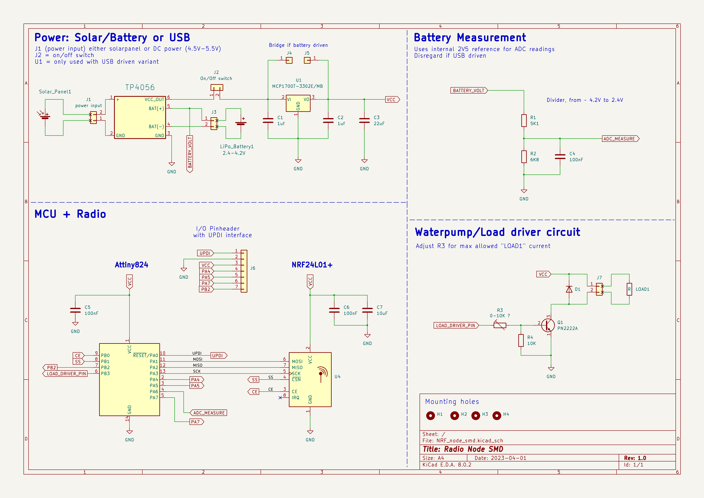
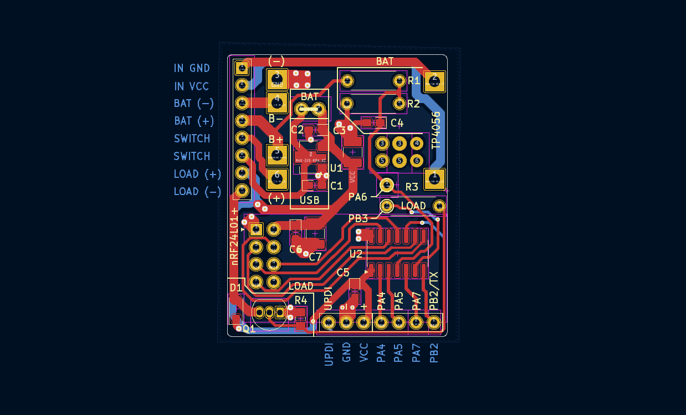
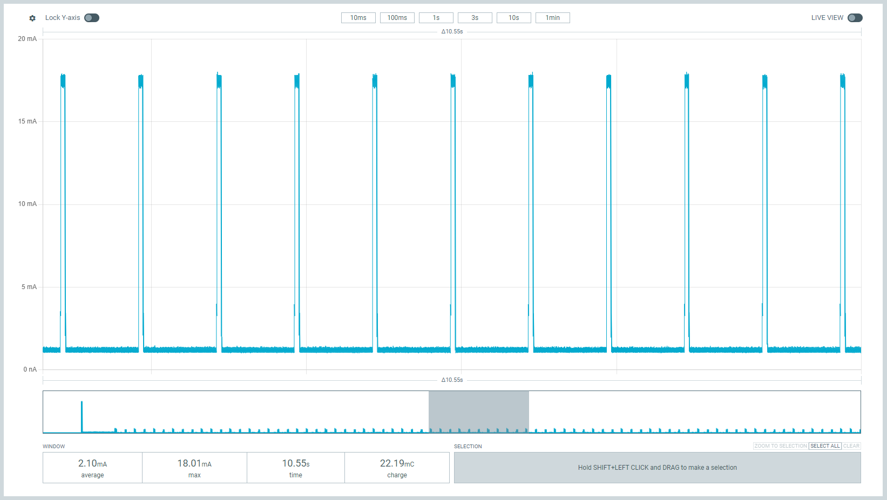
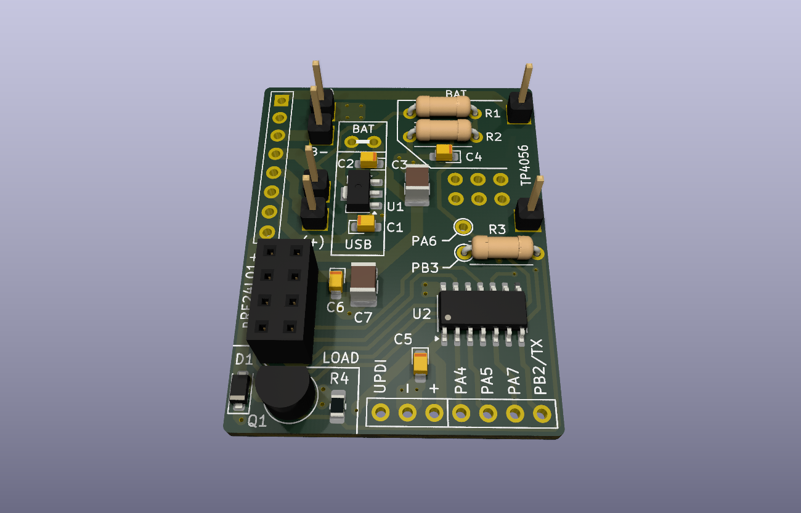
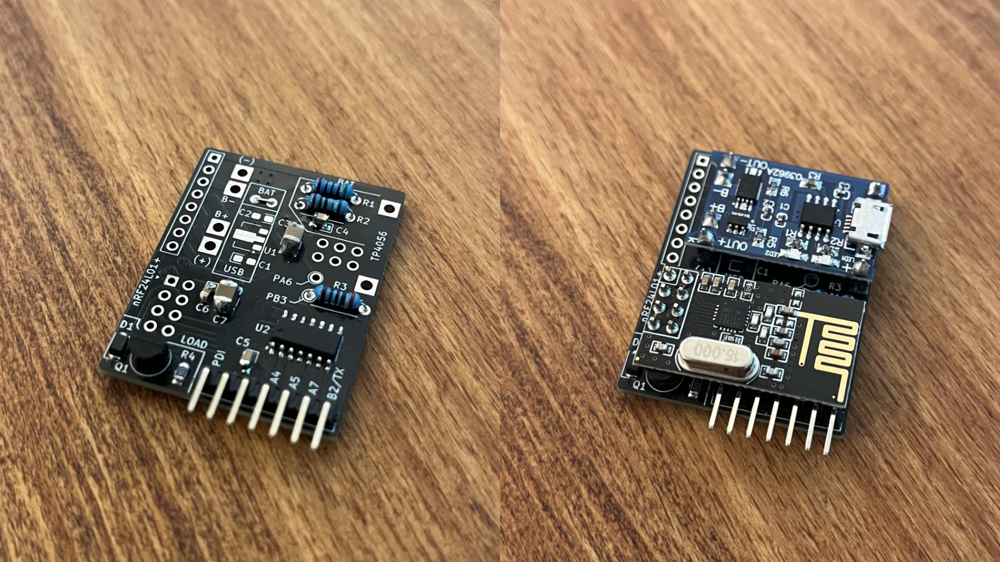
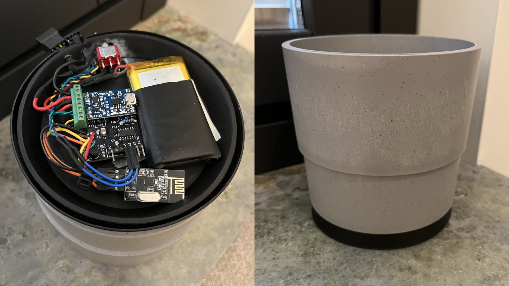

# radio-nodes

Solar/Battery/USB powered wireless "smarthome" modules, based on the Attiny824 microcontroller.  
Serves as the end-node of [MQTT-radio-gateway](https://github.com/Peppson/MQTT-radio-gateway).   
Written in C++ with PlatformIO.  

&nbsp;
## Project Overview
- Each node is easily configurable to perform various tasks, such as watering plants,  
turn on the coffeemaker, opening blinds, relaying sensor data, etc. 

- Power consumption was the main concern when designing this.   
Nodes consumes ∼`2mA` @ 3.3V in active listening mode, and as low as ∼`3uA` @ 3.3V while deepsleeping!  
Making it possible to power some nodes indefinitely from a small solarpanel.  
Measured and optimized using [Power Profiler Kit II](https://www.nordicsemi.com/Products/Development-hardware/Power-Profiler-Kit-2).  

- This project was primarily made for personal ***"needs"***. But it is open for use by anyone who finds it beneficial.  
Every ***node*** has it's own directory inside `src` with it's own enviroment, selected from `platformio.ini`.

&nbsp;
## Hardware and PCB  
Made a compact PCB integrating a [TP4056](https://www.amazon.com/TP4056/s?k=TP4056) Li-ion/LiPo battery charger, an [nRF24L01+](https://www.amazon.com/s?k=nRF24L01%2B&crid=1VM0GXMUG7ISX&sprefix=nrf24l01%2B%2Caps%2C145&ref=nb_sb_noss_1) radio,   
and the [Attiny824](https://www.mouser.se/ProductDetail/Microchip-Technology/ATTINY824-SSF?qs=pUKx8fyJudA6%2F%2FVSNIlI1w%3D%3D) AVR microcontroller.  

More images in: [📂 _images/](./_images/)  
KiCad files: [📂 _KiCad/](./_KiCad/)  

    Schematic

  

  

    PCB layout 

     
    
> 2-layer PCB, dimensions 42mm x 31mm.  
> The PCB has 3 sections, configurable based on the node.
> - ***BAT or USB:*** Battery or USB/5V driven.  
> - ***LOAD:*** Components for the "load driver circuit".  

  

  

    Power consumption in active mode 

  

> In active mode, the node toggles its radio `on` for 50ms and `off` for 950ms to minimize power usage,    
> halting the CPU between pulses.  
>
> Resulting in an average power draw of ∼2mA @ 3.3V.  

  

    Programming

  

The ATtiny 2-series MCUs have [UPDI](https://onlinedocs.microchip.com/pr/GUID-F626284A-58F0-4C25-A6F3-0EA5054F3E2B-en-US-6/index.html?GUID-D25E0E3F-4FC2-454B-8A2D-C52EAA4EBE81) interface. Which makes it possible to program with only 1 data pin!  
You can see the UPDI pins at the bottom of the PCB. 

I created a simple DIY programmer using an Arduino Nano, to help with uploading firmware.   
More details here [UPDI programmer](https://github.com/Peppson/simple-UPDI-programmer).

  
    
### PCB
    

### Hardware
> With and without the TP4056 and nRF24L01+ modules. Dimensions 42mm x 31mm.  
> The picture shows a battery/solar-powered node.

  

&nbsp;
## Nodes 

    Nodes 1-10: Self watering plants  

  
Uses a 3-5V waterpump and DIY capacative fluid-level sensor.  See link below.  
[Liquid Level Sensing Using Capacitive-to-Digital Converters](https://www.analog.com/en/analog-dialogue/articles/liquid-level-sensing-using-cdcs.html)  

The solar-powered variant uses the TP4056 to charge a Li-ion/LiPo battery.  
While the USB variant skips that step and plugs directly into 5V (with 3.3V LDO onboard).  

#### Node 1 water sensor linearity:    

> Sensor (ADC) reading vs water level in %. 

#### Node 1 hardware:  

> Most of the self-watering plant nodes have the hardware inside a plastic enclosure,   
> which I just hide behind the pots.  
> However, for node 1, I placed all electronics underneath for a pretty decent look.   

&nbsp;  

 

    

        Node 11: Mocca Master controller
    

Uses a SG90 servo mounted internally to toggle the `On/Off` button,   
and a hall-effect current sensor, to get the current state.
  
> "Looks pretty neat when the button toggles all by itself :)"   

&nbsp;  
